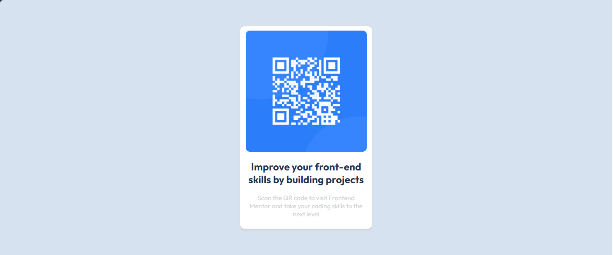

# Frontend Mentor - QR code component solution

This is a solution to the [QR code component challenge on Frontend Mentor](https://www.frontendmentor.io/challenges/qr-code-component-iux_sIO_H). Frontend Mentor challenges help you improve your coding skills by building realistic projects. 

## Table of contents

- [Overview](#overview)
  - [Screenshot](#screenshot)
  - [Links](#links)
- [My process](#my-process)
  - [Built with](#built-with)
  - [What I learned](#what-i-learned)
  - [Continued development](#continued-development)
  - [Useful resources](#useful-resources)
- [Author](#author)
- [Acknowledgments](#acknowledgments)

**Note: Delete this note and update the table of contents based on what sections you keep.**

## Overview

### Screenshot



### Links

- Solution URL: [Github Repository](https://github.com/Bkevin3110/learning-QRCODE)
- Live Site URL: [Netlify Site upload.](https://silly-mermaid-df5ebc.netlify.app/)

## My process
- Started with visualizing then inserting how many divs I would need.
- Made a div container, card, card-content, and card-text.
- visualized which part of the content should have certain css styled.
- Made with mobile-first. 
- Container set size and background.
- Use flex to center the card.
- made the card with white background. Sized to close to design images.
- card-content - to center the image and text
- card-qrimg - set the size of the cards
- card-text - set text size and colors.

- Inserted google font at the top of the page and then set them in body.
### Built with

- CSS
- Flexbox
- Mobile-first workflow


### What I learned

Was brushing up on html/css as I am starting as Software Developer. I was in training at my internship and working backend seemed to go pretty easy for me. But working on front end design where I lacked any experience.
I started the scrimba course for html/css. Now I'm Here.


Having to put the font connection before styling for it to work properly with CSS.
```html
<link rel="preconnect" href="https://fonts.googleapis.com">
  <link rel="preconnect" href="https://fonts.gstatic.com" crossorigin>
  <link href="https://fonts.googleapis.com/css2?family=Outfit:wght@400;700&display=swap" rel="stylesheet">
```
Learning from scrimba concept of divs being boxes helped immensely.
Still need to figure out a way besides flexbox to maybe center align?
text align?
```css
.container{
    background-color: hsl(212, 45%, 89%);
    width: 375px;
    height: 600px;
    display: flex;
    justify-content: center;
    align-items: center;
}

.card{
    width: 300px;
    background-color: hsl(0, 0%, 100%);
    border-radius: 10px;
    padding: 10px 5px;
    box-shadow: 0px 4px 3px lightgrey;
}

.card-content{
    display: flex;
    justify-content: center;
    align-items: center;
    flex-direction: column;
}

```


### Continued development

Maybe learn how to CSS grid row? otherwise improve on how/when to use flexbox vs blocking. Improve visual to designing mind. Had some issues on how many Divs I would need or could remove? I ended up removing a div between container and card.

Please let me know what I can improve on as I am very new to html/css!

### Useful resources

- [Scrimba](https://scrimba.com/learn/htmlandcss) - This free course helped me alot learn the basis of HTML/CSS.
- Googling as helped a lot as theres lots of resources out there to look for what you need.


## Author


- Frontend Mentor - [@Bkevin3110](https://www.frontendmentor.io/profile/Bkevin3110)


## Acknowledgments

Frontend for making these for me to learn!!.
